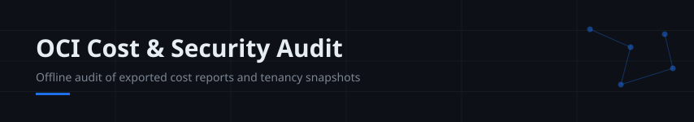
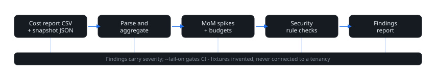

> **Independent portfolio simulation** · Runs fully offline on exported files · No OCI SDK, no credentials, no tenancy calls, no spend. Fixture data and names are invented.

**Start here:** `python3 audit.py --cost-report fixtures/cost_report.csv --snapshot fixtures/tenancy_snapshot.json` · `python3 -m unittest discover -s tests -v`

A cost-and-posture audit CLI in the shape an OCI architect actually needs: point it at an exported cost report and a tenancy configuration snapshot, and it produces one findings report - cost aggregation, month-over-month spikes, budget breaches and security posture rules, each with a severity, plus a `--fail-on` gate so CI can fail a change that introduces a critical finding.

## What it checks



**Cost analysis** (from `fixtures/cost_report.csv` style exports):

- Totals by service and compartment; top spenders above a threshold flagged INFO.
- Month-over-month change per service; a rise of >=30% and >=50 units flags `cost_spike` (HIGH).
- Budgets from the snapshot compared against the **latest month's** compartment cost; breach flags `budget_exceeded` (CRITICAL).

**Security posture rules** (from `fixtures/tenancy_snapshot.json` style exports):

| Rule | Severity | Fires when |
| --- | --- | --- |
| `public_bucket` | HIGH | An object storage bucket allows public access |
| `open_admin_port` | HIGH | A security list opens port 22/3389 to `0.0.0.0/0` |
| `open_data_port` | HIGH / CRITICAL | A security list opens a data-service port to `0.0.0.0/0`: 3306 MySQL and 5432 PostgreSQL are HIGH; 6379 Redis, 27017 MongoDB and 9200 Elasticsearch are CRITICAL because they often run unauthenticated by default |

Port rules accept `port` or an inclusive `port_range: [lo, hi]`. Rules with `"stateless": true` are reported with a note that return traffic needs its own egress rule; stateful rules are noted as tracked. Severity is the same for both, the detail text differs. Egress rules and service-level authentication are not evaluated.
| `broad_policy` | MEDIUM | A non-admin group may `manage all-resources` in tenancy |
| `user_without_mfa` | MEDIUM | A console user has no MFA enabled |
| `old_api_key` | LOW | A user API key is older than 90 days |
| `no_budget` | MEDIUM | No budgets exist at all - spend has no guardrail |

## Run

Python 3.10+, standard library only - no install, no network:

```bash
python3 audit.py --cost-report fixtures/cost_report.csv --snapshot fixtures/tenancy_snapshot.json
python3 audit.py --cost-report fixtures/cost_report.csv --snapshot fixtures/tenancy_snapshot.json --output report.json
python3 audit.py --cost-report fixtures/cost_report.csv --snapshot fixtures/tenancy_snapshot.json --json   # structured JSON on stdout (summary, cost tables, findings)
python3 audit.py --cost-report fixtures/cost_report.csv --snapshot fixtures/tenancy_snapshot.json --fail-on HIGH   # CI gate; exits 1
python3 -m unittest discover -s tests -v
```

Input formats: cost CSV columns `date,service,compartment,usage_amount,cost`; snapshot JSON keys `buckets`, `security_lists`, `iam_policies`, `users`, `budgets` (see the bundled fixtures for the exact shape). Bring your own exports in the same shapes to audit real data.

## Honest limits

- The bundled fixtures are invented; findings on them demonstrate the rules, not a real tenancy's posture.
- Exports must be produced elsewhere (OCI cost report, CLI/console exports); this tool never calls OCI, so nothing here has been validated against live Usage API or IAM responses. Field names follow common export shapes, not a guaranteed Oracle schema.
- Rules are transparent heuristics with fixed thresholds, not a benchmark of Oracle Cloud Guard or Security Advisor. A production rollout would add per-rule configuration, trend history, pagination over large exports and signed audit logs.

## Layout

```
audit.py                    CLI and all analysis logic (stdlib only)
fixtures/                   invented cost report CSV and tenancy snapshot JSON
tests/                      unittest suite: parsing, cost math, every rule, gate behavior
.github/workflows/ci.yml    tests + CLI smoke run + gate behavior on Python 3.10-3.12
```
